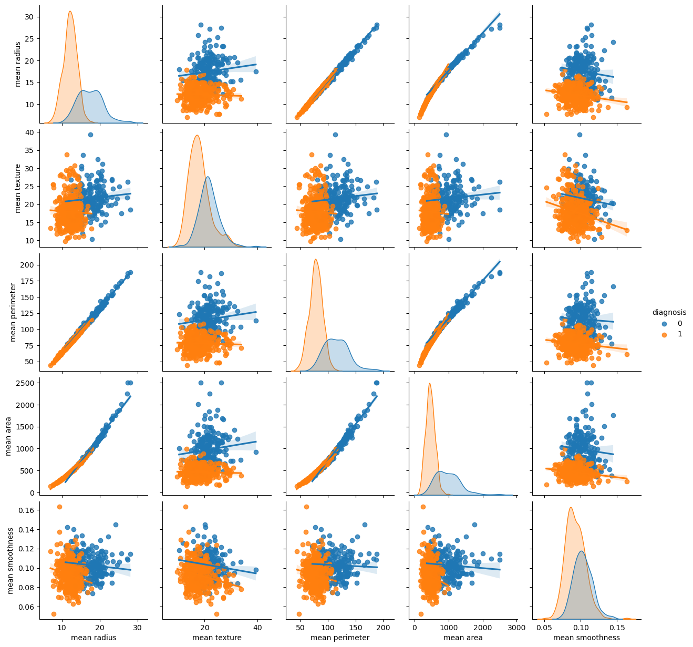
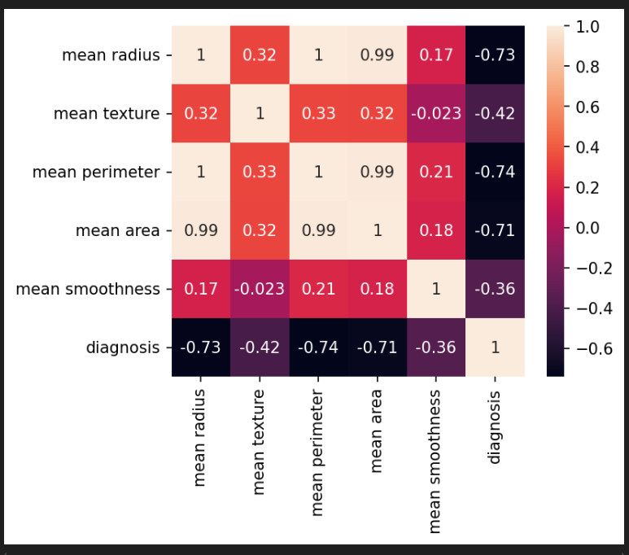
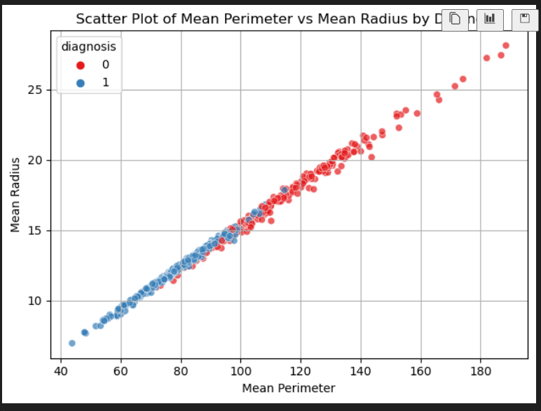
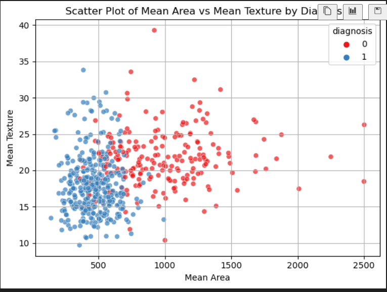
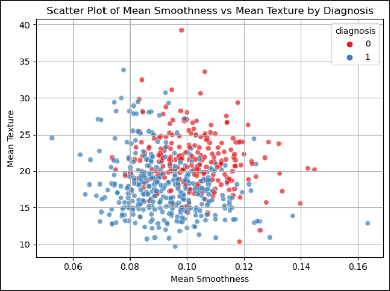
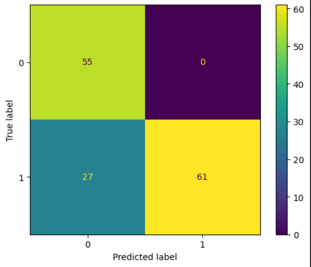
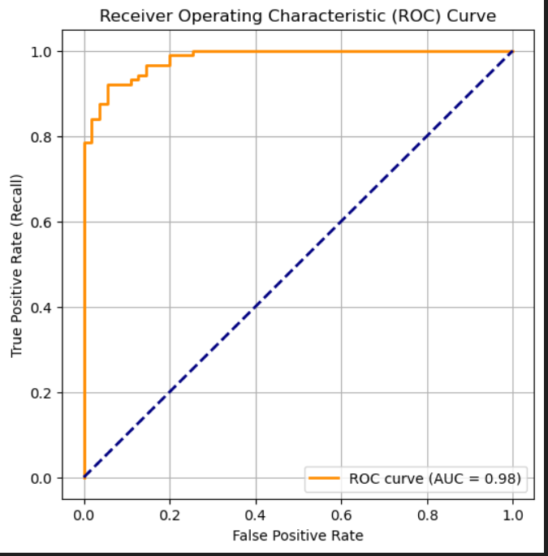
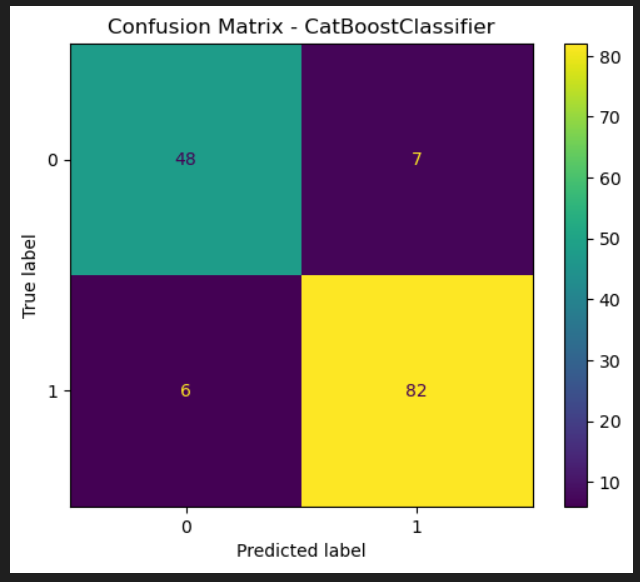
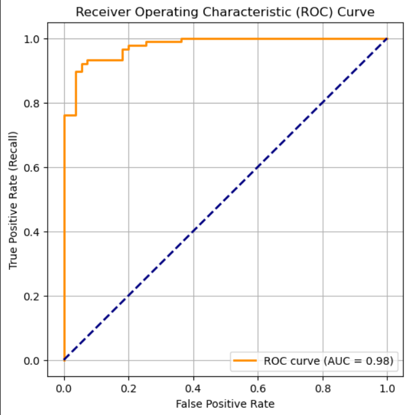

# 🧬 Breast Cancer Classification using Logistic Regression and CatBoost

This repository presents a machine learning pipeline for classifying breast cancer as **malignant** or **benign** using the Wisconsin Breast Cancer dataset. I explored two classification models:

- Logistic Regression (as a baseline)
- CatBoostClassifier (advanced boosting model)

---

## 📁 Dataset Overview

- **Source:** University of Wisconsin Hospitals, Madison
- **Target Variable:** `diagnosis` (0 = Benign, 1 = Malignant)
- **Features:** Various statistical measures (e.g., mean radius, mean area, mean texture, etc.)

---

## 📊 Exploratory Data Analysis

### 🔹 Pair Plot of Selected Features

> This plot helps visualize the **pairwise relationships** between selected numerical features colored by the `diagnosis` class.
>
> - Diagonal plots show the **distribution (KDE)** of each feature.
> - Off-diagonal plots show **scatterplots with regression lines**.
> - From the plot:
>   - `mean radius`, `mean perimeter`, and `mean area` show strong linear relationships and class separation.
>   - Benign tumors (label 0) tend to cluster separately from malignant tumors (label 1), especially in the size-based features.

### 🔹 Correlation Heatmap

> Strong positive correlation observed between `mean perimeter`, `mean area`, and `mean radius`, indicating potential multicollinearity.

### 🔹 Scatter Plots

#### • Mean Perimeter vs Mean Radius

> Clear linear relationship observed; higher values often correspond to benign tumors.

#### • Mean Area vs Mean Texture

> Less distinct class separation; highlights the importance of using multiple features.

#### • Mean Smoothness vs Mean Texture

> Overlap in classes indicates these features may contribute more when combined with others.

---

## ⚙️ Logistic Regression Model

### 🔹 Preprocessing:

- scaled the data using StandardScaler
- Split the data to training and test sets. Training set was 75%, and 25% for test set.

### 🔹 Grid Search:

- For the logistic regression model I tuned `C`, `penalty`, `solver`, `max_iter` using `GridSearchCV` from scikit-learn.

### 🔹 Evaluation:

- **Test Accuracy:** The optimal model achieved an accuracy score of `91%`
- **AUC:** The area under curve (AUC) was `0.98`

#### • Confusion Matrix:

> Logistic regression performed well but had 7 false negatives, which are critical in cancer diagnosis.

#### • ROC Curve:

> AUC of 0.98 shows excellent discriminative power of the model.

---

## 🚀 CatBoostClassifier model

### 🔹 Grid Search:

- For CatBoostClassifier I tuned `depth`, `iterations`, `learning_rate`, `l2_leaf_reg` of the model.

### 🔹 Evaluation:

- **Test Accuracy:** The model achieved an accuracy score of `90.9%`.
- **AUC:** The area under curve (AUC) was `0.98`

#### • Confusion Matrix:

> For CatBoostClassifier there was a slightly improved recall, reducing false negatives from 7 to 6.

#### • ROC Curve:

> Also achieved an AUC of 0.98, indicating excellent performance similar to logistic regression.

---

## 💾 Model Saving and Reuse

Saved the model using joblib.dump() and loade it to test its accuracy in predicting the first row from the dataframe and the prediction was accurate.

---

## ✅ Conclusion

Both models achieved excellent performance:

- **Logistic Regression** had slightly better precision.
- **CatBoostClassifier** slightly reduced **false negatives**, which is crucial in medical diagnosis.

I saved the model `CatBoostClassifier` ready for streamlit app development.

---

## 📌 Requirements

- Python 3.8+
- scikit-learn
- catboost
- pandas, matplotlib, seaborn
- joblib

---

### Author: Obadiah Kiptoo

---

## 📬 Acknowledgments

- Dataset courtesy of Dr. William H. Wolberg
- University of Wisconsin Hospitals, Madison
